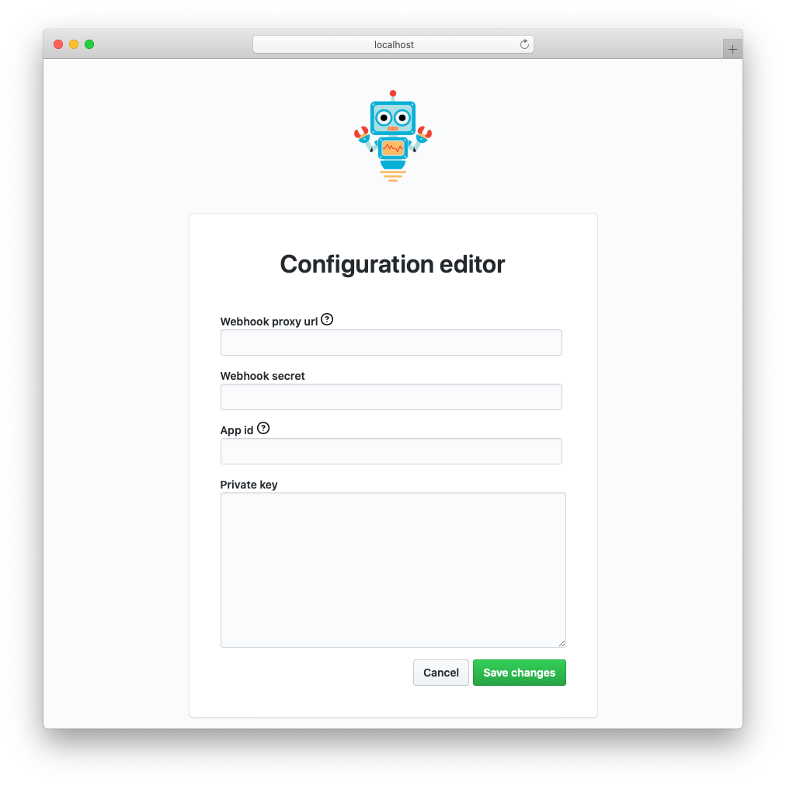

<h1 align="center">Probot Extended Setup</h1>

<p align="center">A GitHub App built with <a href="https://github.com/probot/probot">Probot</a> that provides a web editor for configuring Probot apps</p>

<p align="center">
  <a href="https://github.com/jasonmacgowan/probot-extended-setup/actions?query=workflow%3ACI"></a>
  <a href="https://github.com/semantic-release/semantic-release"></a>
  <a href="https://npmjs.com/package/probot-extended-setup"></a>
  <a href="http://commitizen.github.io/cz-cli/"></a>
<p>

<p align="center">
  
</p>

## Getting started

### Install

```Bash
# Install dependencies
npm install probot-extended-setup
```

### Create params.yml

Probot Extended Setup reads a file in your app's root directory named `params.yml`. It uses this file to determine what and how it should let you configure environment variables via a web ui.

See [params.yml](params.yml) for a simple example.

#### Options

`params.yml` is written as an top-level array, with each element supporting these options:

- `name` - required - a friendly name for the parameter
- `description` - optional - a terse representation of what this parameter is used for that is shown as a tooltip in the editor
- `env` - required - the environment variable key that will be used when saving and loading this paramter to `.env`
- `inputType` - optional, defaults to `text` - the HTML input type to render this paramter's value with. Supported values below:
  - `text` default input control
  - `password` masks input
  - `checkbox` supports `true`/`false` values
  - `textarea` multi-line text input control

### Load the plugin

Add `probot-extended-setup` to your Probot App

```JavaScript
const ExtendedSetup = require('probot-extended-setup');

/**
 * This is the main entrypoint to your Probot app
 * @param {import('probot').Application} app
 */
module.exports = (app) => {
  app.load(ExtendedSetup);

  // your Probot App code here
}
```

### Using the editor

1. Start your application and navigate to [https://127.0.0.1:3000/probot/setup/extended](https://127.0.0.1:3000/probot/setup/extended).
2. Edit your application configuration in the web form then save it.
3. `probot-extended-setup` merges your changes into your existing config and saves it to `.env` in the root directory.

### Access control

Access to the configuration editor is restricted to `localhost`.

You can also access the editor by supplying a generated token that can be found in the startup logs and `<rootDir>/.token`.

### Reading the config

The Probot framework automatically loads the contents of `.env` into the environment variables for your app's running process. You can access them in your code by accessing `process.env.<PARAMETER_NAME>`, i.e. `process.env.APP_ID`

## Contributing

Commits follow the [Angular commit convention](https://github.com/angular/angular.js/blob/master/DEVELOPERS.md#-git-commit-guidelines) and this repository is [commitizen friendly](https://github.com/commitizen/cz-cli). In a general sense this means you'll want run `npm run git-commit` or `git cz` instead of `git commit`.

If you have suggestions for how probot-extended-setup could be improved, or want to report a bug, open an issue! We'd love all and any contributions.

For more, check out the [Contributing Guide](CONTRIBUTING.md).

## Releasing

This project uses [semantic-release](https://github.com/semantic-release/semantic-release) to handle releasing and publishing new versions. Merging pull requests into the `main` branch automatically runs this process via [GitHub Actions](.github/workflows/release.yml).
